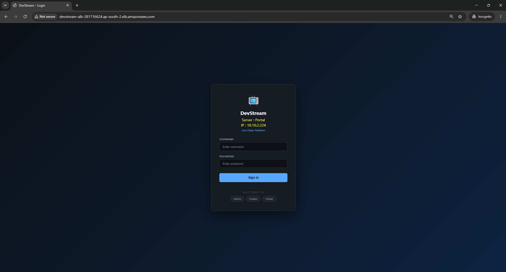
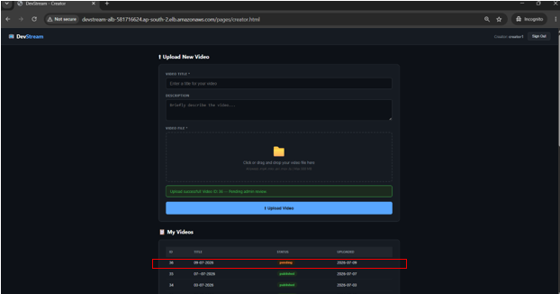
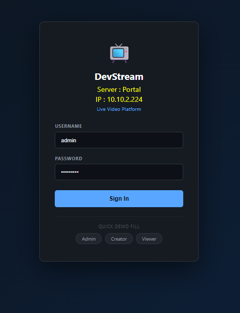
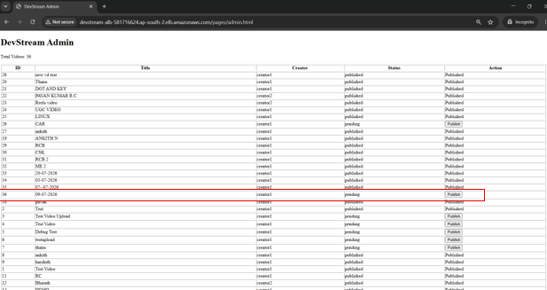
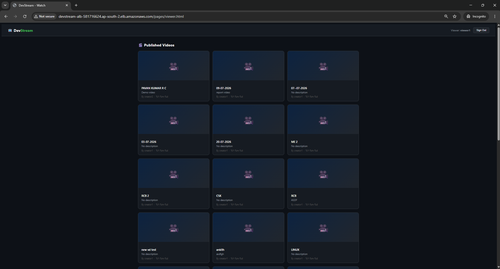
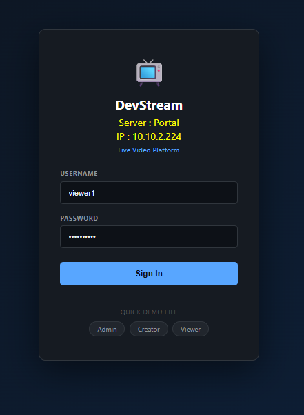
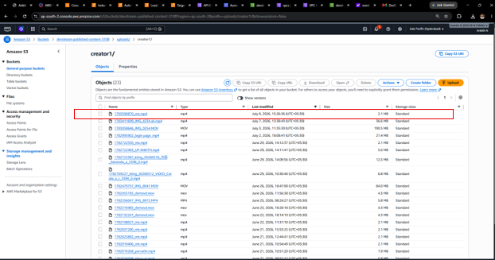
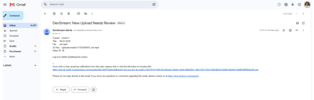
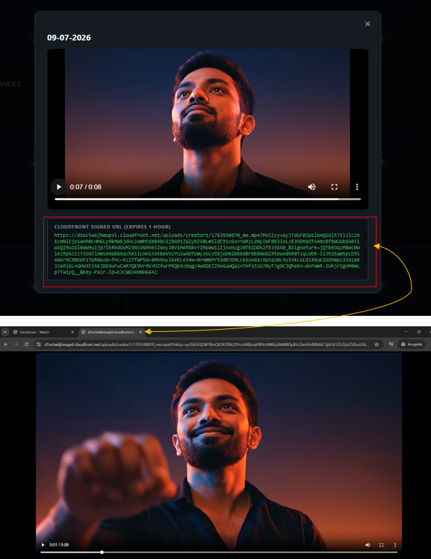

# DevStream AWS Live Video Platform Infrastructure
  (Advanced Linux + AWS End-to-End Deployment Project)

## Introduction
DevStream is a secure cloud-based live video platform developed using AWS and Linux technologies. The project demonstrates secure content upload, processing, storage, and streaming using a multi-tier architecture. It implements network isolation through a Virtual Private Cloud (VPC), dedicated public and private subnets, route tables, and Security Groups to ensure secure communication between all components. The system integrates AWS services such as EC2, Amazon S3, AWS Lambda, Amazon RDS MySQL, API Gateway, CloudFront, and Application Load Balancer to build a scalable and highly available solution. The project highlights cloud networking, automation, Linux administration security, and infrastructure best practices while providing an efficient and reliable live video streaming platform. 

## Technologies

- AWS EC2
- Auto Scaling Group
- Application Load Balancer
- Amazon S3
- CloudFront
- AWS Lambda
- API Gateway
- Amazon RDS
- Amazon SNS
- VSFTPD (FTP over TLS)
- NFS
- LVM
- LUKS Encryption
- Nginx
- FastAPI
- Cron Automation

## AWS Architecture

## Project Structure

- website/
- nginx/
- scripts/
- docs/
- architecture/
- screenshots/
  ## Login Page

User authentication page for secure access to the platform.

---

## Upload Page

Content creators can upload videos along with metadata.

---

## Admin Dashboard

Administrators can review and manage uploaded videos.

---

## Video Approval

Admin approval workflow before videos are published.

---

## Published Videos

Approved videos available for viewers through CloudFront.

---

## Viewer Page

Users can browse and securely stream published videos.

---

## Amazon S3

Private S3 bucket used for storing uploaded video files.

---

## Amazon SNS

SNS notifications sent when new videos require approval.

---

## Amazon CloudFront

CloudFront distribution used for secure and low-latency video delivery.

Conclusion: 
The DevStream project successfully demonstrates the design and implementation of a secure, scalable, and highly available cloud based video streaming platform using Amazon Web Services (AWS) and Linux. The application enables content creators to upload videos securely, administrators to review and publish content, and viewers to stream approved videos through Amazon CloudFront using Signed URLs. The infrastructure incorporates Amazon EC2, VPC, RDS, S3, CloudFront, Lambda, SNS, Application Load Balancer, and Auto Scaling to ensure security, performance, and high availability. Linux administration features such as NFS, LVM, LUKS encryption, ACLs, and Cron Jobs further strengthen storage management and system security. The project follows AWS best practices by using private networking, secure access through a Bastion Host, and automated scaling based on workload. End-to-end testing verified the successful integration of all components and demonstrated reliable application performance.

Developed by Ankith Nagaraj
